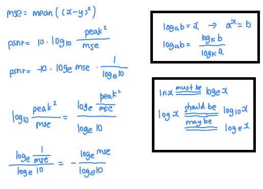

- [1. overview](#1-overview)
- [2. psnr和ssim](#2-psnr和ssim)
  - [2.1. data\_range](#21-data_range)
  - [2.2. psnr](#22-psnr)
  - [2.3. ssim](#23-ssim)
- [3. lpips](#3-lpips)

----
## 1. overview

```python
from skimage.metrics import structural_similarity, peak_signal_noise_ratio
# pip install lpips
import lpips

# 建议HWC. CHW也行，改channel_axis就行
img_ndarry, img2_ndarry = ...
# dtype=torch.float32, device='cpu', [C, H, W]
img_tensor, img2_tensor = ...


psnr = peak_signal_noise_ratio(img_ndarry, img2_ndarry, data_range=1)

ssim = structural_similarity(img_ndarry, img2_ndarry, data_range=1, channel_axis=2)

lpips_model = lpips.LPIPS(net='vgg')
lpips = lpips_model(img_tensor, img2_tensor, normalize=True) 
```

## 2. psnr和ssim
old name:
- `skimage.metrics.peak_signal_noise_ratio`: `skimage.measure.compare_psnr`
- `skimage.metrics.structural_similarity`: `skimage.measure.compare_ssim`

[0, 255] 的 uint8, [0.0, 1.0] 的 float 的ndarry都行。

shape相同, 建议[H,W,3]。

### 2.1. data_range

The data range of the input image (distance between minimum and maximum possible values). By deault, 255 for uint8, 1 for float.

当是float时，最好还是都指定, `data_range=1`. 

- `dtype_range`
```python
from skimage.util.dtype import dtype_range

dtype_range[a.dtype.type]
# np.uint8 (0, 255)
# np.float32 (-1, 1)
# np.float64 (-1, 1)
```
- psnr：是255和1
    ```python
    # psnr内部代码
    if true_min >= 0:
        # most common case (255 for uint8, 1 for float)
        data_range = dmax
    else:
        data_range = dmax - dmin
    ```
- ssim：是255和2

    If `data_range` is not specified, the range is automatically guessed based on the image data type. However for floating-point image data, this estimate yields a result double the value of the desired range, as the `dtype_range` in `skimage.util.dtype.py` has defined intervals from `-1` to `+1`. 
    
    This yields an estimate of 2, instead of 1, which is most often required when working with image data (as negative light intentsities are nonsensical).

    ```python
    # ssim内部代码
    dmin, dmax = dtype_range[im1.dtype.type]
    data_range = dmax - dmin
    ``` 
### 2.2. psnr

可以看出，只要shape相同，[H,W,C],[C,H,W],[H*W,C]等等都行。
```python
from skimage.metrics import peak_signal_noise_ratio
# [0.0, 1.0] data_range=1., or [0, 255] data_range=255.
psnr = peak_signal_noise_ratio(img_ndarry, img2_ndarry, data_range=1)

# 内部展开就是下面的psnr
```
```python
# [0.0, 1.0] data_range=1., or [0, 255] data_range=255.
def psnr(p0, p1, data_range=255.):
    return 10 * np.log10(data_range**2/np.mean((1.*p0-1.*p1)**2))
```
```python
# [0.0, 1.0]
img2mse = lambda x, y : torch.mean((x - y) ** 2)
# mse2psnr = lambda x : -10. * torch.log(x) / torch.log(torch.Tensor([10.]))
mse2psnr = lambda x : 10. * torch.log10(1.0 / x)

mse2psnr(img2mse(p0, p1))
```
  

### 2.3. ssim

- unit8还是float
    ```python
    # imageA, imageB 是 float
    ssim = structural_similarity(imageA, imageB, data_range=1)
    ```
    ```python
    # imageA, imageB 是 unit8
    ssim = structural_similarity(imageA, imageB, data_range=255)
    ```

- 灰度图还是彩色图
    ```python
    # imageA, imageB 是 灰度图
    ssim = structural_similarity(imageA, imageB, data_range=1)
    ```
    CHW也行，改channel_axis就行。
    ```python
    # imageA, imageB 是 彩色图
    ssim = structural_similarity(imageA, imageB, data_range=1, channel_axis=2)
    ```
- 差别图：
    ```python
    # full=True
    # 无论imageA, imageB是uint8还是float，diff返回的都是 [0,1.0]的float类型
    score, diff = structural_similarity(imageA, imageB, data_range=1, channel_axis=2, full=True)
    ```

```python
'''
compute the Structural Similarity Index (SSIM) between the two images
'''
import cv2
import numpy as np
from skimage.metrics import structural_similarity

# load the two input images
imageA = cv2.imread(r'D:\git\NeuLF\result\Exp_t_fern\train\epoch-870\gt.png')
imageB = cv2.imread(r'D:\git\NeuLF\result\Exp_t_fern\train\epoch-870\recon.png')

imageA = imageA / 255
imageB = imageB / 255

# full=True：添加一个返回对象，图片的差别
score, diff = structural_similarity(imageA, imageB, data_range=1, channel_axis=2, full=True)
print("SSIM: {}".format(score))

diff = (diff * 255).astype(np.uint8)
diff_gray = cv2.cvtColor(diff, cv2.COLOR_BGR2GRAY)

# 下面框选轮廓只是在diff的灰度图上进行，因而不是准的
# threshold the difference image, followed by finding contours to obtain the regions of the two input images that differ
thresh = cv2.threshold(diff_gray, 0, 255, cv2.THRESH_BINARY_INV | cv2.THRESH_OTSU)[1]
cnts = cv2.findContours(thresh.copy(), cv2.RETR_EXTERNAL, cv2.CHAIN_APPROX_SIMPLE)
cnts = cnts[0] if len(cnts) == 2  else cnts[1]

mask = np.zeros(imageA.shape, dtype='uint8') 
filled_mask = imageA.copy()

# loop over the contours
for c in cnts:
	# compute the bounding box of the contour and then draw the
	# bounding box on both input images to represent where the two
	# images differ
    (x, y, w, h) = cv2.boundingRect(c)
    cv2.rectangle(imageA, (x, y), (x + w, y + h), (0, 0, 255), 2)
    cv2.rectangle(imageB, (x, y), (x + w, y + h), (0, 0, 255), 2)
    cv2.drawContours(mask, [c], 0, (0,255,0), -1)
    cv2.drawContours(filled_mask, [c], 0, (0,255,0), -1)

# show the output images
cv2.imshow("imageA", imageA)
cv2.imshow("imageB", imageB)
cv2.imshow("diff", diff)
cv2.imshow("diff_gray", diff_gray)
cv2.imshow("thresh", thresh)
cv2.imshow("mask", mask)
cv2.imshow("filled_mask", filled_mask)
cv2.waitKey(0)
```
可以看出用灰度图框选不太准（毕竟三通道融合了）

## 3. lpips
- `torchmetrics.image.lpip.LearnedPerceptualImagePatchSimilarity`就是在调用`lpips.LPIPS`，所以`normalize=True`的特性是一样的。
- `torchmetrics.image.lpip.LearnedPerceptualImagePatchSimilarity`是对一个batch（即N)，求得一个整体平均的lpips。
- `lpips.LPIPS`是对一个batch（即N)，求得N个每张图片的lpips。
- 需要输入的是两个`tensor`, 不能ndarry, `dtype=torch.float32`和`device='cpu'`格式（内部调用vgg的时候是cpu，因而如果传入gpu会出现设备的不一致问题，float32是因为从numpy直接转化过来是float64，也有精度的不一致问题）
- 建议[0, 1.0]的图片, `normalize=True`
```python
import lpips
import torch
import numpy as np
_ = torch.manual_seed(123)
np.random.seed(123)

# pip install torchmetrics[image] 
# pip install lpips
from torchmetrics.image.lpip import LearnedPerceptualImagePatchSimilarity
# 默认normalize=False needs the images to be in the [-1, 1] range. normalize=True is in the [0, 1] range.
# 默认reduction = 'mean', 还可以'sum'
torch_lpips = LearnedPerceptualImagePatchSimilarity(net_type='vgg', normalize=True)
# 要求tensor，
# [N, C, H, W], 不能[C, H, W]
img1 = np.random.rand(10, 3, 100, 100)
img2 = np.random.rand(10, 3, 100, 100)

l = torch_lpips(torch.tensor(img1, dtype=torch.float32), torch.tensor(img2, dtype=torch.float32))
print(l)
# tensor(0.3494, grad_fn=<SqueezeBackward0>)


# pip install lpips
loss_fn_vgg = lpips.LPIPS(net='vgg')
l2 = loss_fn_vgg(torch.tensor(img1, dtype=torch.float32), torch.tensor(img2, dtype=torch.float32), normalize=True) 
print(l2.shape)
# torch.Size([10, 1, 1, 1])
print(l2.squeeze())
# tensor([0.3497, 0.3494, 0.3473, 0.3558, 0.3437, 0.3366, 0.3716, 0.3516, 0.3472,
#         0.3413], grad_fn=<SqueezeBackward0>)
print(l2.mean())
# tensor(0.3494, grad_fn=<SqueezeBackward0>)
```